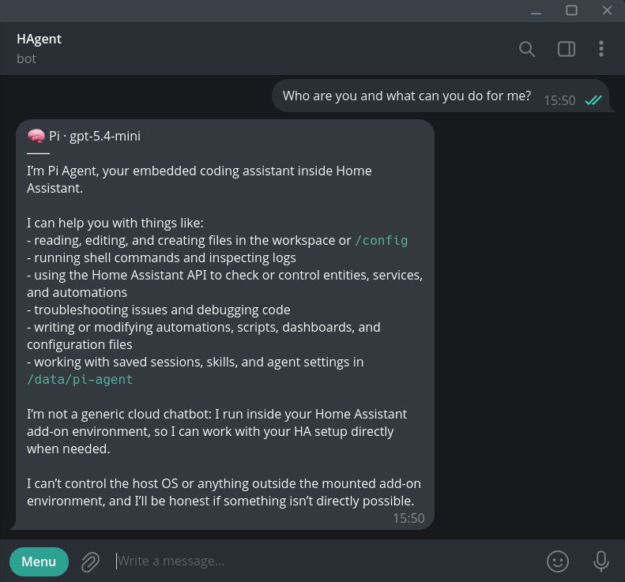
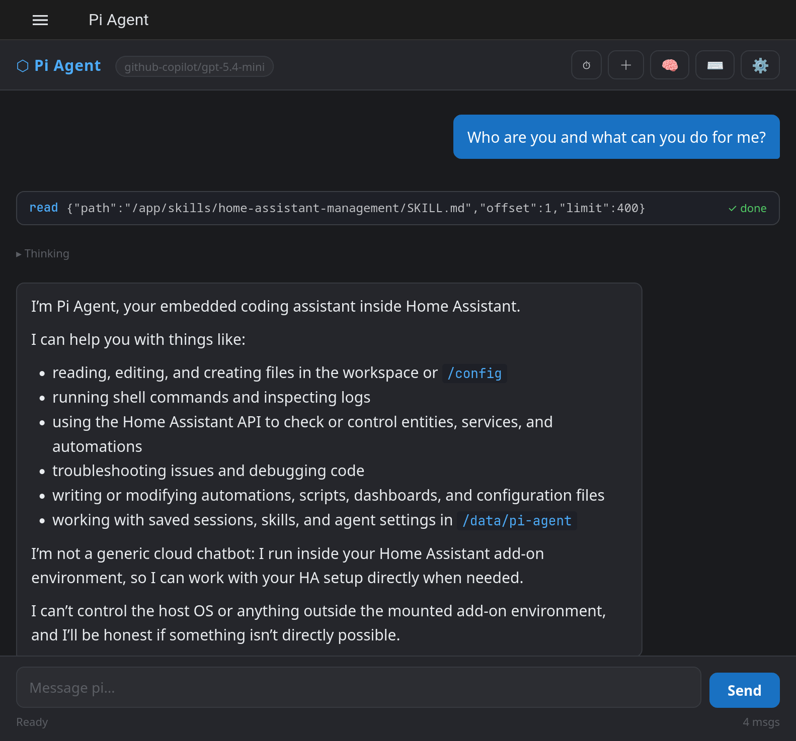
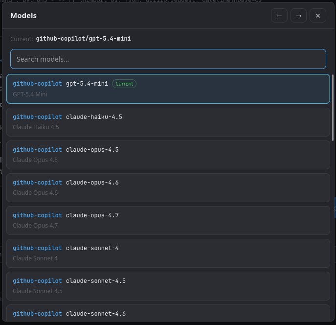
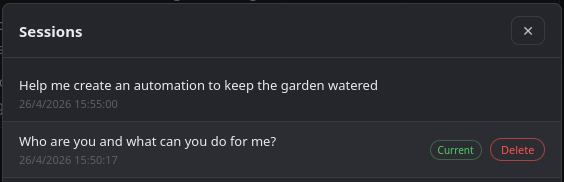

# Home Assistant Pi Agent (HA-Pi)

A [pi agent](https://pi.dev) add-on for Home Assistant OS.

Chat with an AI agent directly from the Home Assistant web UI or Telegram. The agent understands your smart home setup and can help you manage it through natural conversation.

## What Can It Do?

- 🏠 **Create automations** — Describe what you want and the agent writes the YAML for you
- 🔍 **Debug your setup** — Ask why a device isn't responding or an automation isn't triggering
- 💡 **Control devices** — Turn on lights, adjust thermostats, or run scenes through conversation
- 📊 **Explore your system** — List entities, check device states, or review sensor history
- 🛠️ **Edit configuration** — Update `configuration.yaml`, scripts, or any HA config file
- 📱 **Work from anywhere** — Use the web UI at home or Telegram on the go

## Preview

<table>
  <tr>
    <td align="center" width="50%">
      
       
      Telegram bot preview
    </td>
    <td align="center" width="50%">
      
       
      Web UI after loading the Telegram session
    </td>
  </tr>
</table>

## Features

- Full [pi agent](https://pi.dev) embedded in your HA instance
- Web UI accessible from the Home Assistant sidebar
- **Telegram integration** — Chat with your agent from your phone ([setup guide](TELEGRAM_SETUP.md))
- Bundled Home Assistant skill for entity control and automation management
- Session history that persists across restarts and syncs between web and Telegram
- Dynamic model selector with support for multiple AI providers
- Adaptive light/dark UI that follows Home Assistant and browser color scheme preferences
- Customizable agent behavior via add-on options or AGENTS.md file

<table>
  <tr>
    <td align="center" width="50%">
      
       
      Model selection
    </td>
    <td align="center" width="50%">
      
       
      Session selection
    </td>
  </tr>
</table>

## Runtime Information

The agent automatically receives context about its deployment environment:

- Current Home Assistant version
- Add-on version
- Access type (ingress/direct)
- Deployment type (HAOS/Supervised/Standalone)
- System architecture

This information appears in the agent's system prompt, helping it provide context-aware responses.

See [Runtime Information](docs/RUNTIME_INFO.md) for details and troubleshooting.

## Installation

1. Add this repository to your HA add-on store (use button above)
2. Install **Pi Agent**
3. Start the add-on
4. Click **Open Web UI** or find **Pi Agent** in your sidebar
5. Open the Providers modal and add your API key or sign in with OAuth

### First Boot

When you open the first conversation, the agent automatically runs two startup routines — this is expected behaviour, not a sign of something going wrong.

First, it loads the [`home-assistant-management`](pi/skills/home-assistant-management) skill, which gives it awareness of HA service domains, entity patterns, and API conventions.

Second, if no system profile exists yet, it runs the [`system-profile-creator`](pi/skills/system-profile-creator) skill. This inspects your specific HA instance — reading `configuration.yaml`, checking your config structure, sampling a few automations and scripts to pick up your naming conventions and language, and querying available notification services. The result is saved to `/data/pi-agent/agents/skills/system-profile/` and reused in every future session, so this inspection only runs once.

You can ask the agent to refresh the profile at any time by saying *"update system profile"*.

## Configuration

| Option                      | Description                                                         |
| --------------------------- | ------------------------------------------------------------------- |
| `log_level`                 | Server log verbosity (`debug`, `info`, `warn`, `error`)             |
| `agents_md_append`          | Extra instructions for the agent (e.g. `Always respond in Spanish`) |
| `telegram_enabled`          | Enable Telegram bot integration                                     |
| `telegram_bot_token`        | Your Telegram bot token from [@BotFather](https://t.me/BotFather)   |
| `telegram_allowed_chat_ids` | Comma-separated list of allowed Telegram chat IDs                   |

API keys and OAuth tokens are managed from the web UI's Providers modal and stored in `/data/pi-agent/auth.json`.

## Telegram Integration

Chat with your Pi Agent from Telegram! Create a bot via [@BotFather](https://t.me/BotFather), configure the token in the add-on settings, and you're ready to go. Sessions are shared between web and Telegram.

**Quick commands**: `/new` (new session), `/sessions` (list sessions), `/status` (current state)

👉 [Full Telegram setup guide](TELEGRAM_SETUP.md)

## Persistent Storage

Everything in `/data/pi-agent/` persists across upgrades and is included in HA backups:

- **Sessions**: Conversation history
- **Skills**: User-installed agent skills
- **Settings**: Model selection and preferences
- **AGENTS.md**: Your custom agent instructions

The agent can also read and write files in `/config` to edit your Home Assistant configuration directly.

## Documentation

See [DOCS.md](DOCS.md) for detailed information on providers, session management, skill installation, and troubleshooting.

## Support

Open an issue on [GitHub](https://github.com/elboletaire/ha-pi/issues).
